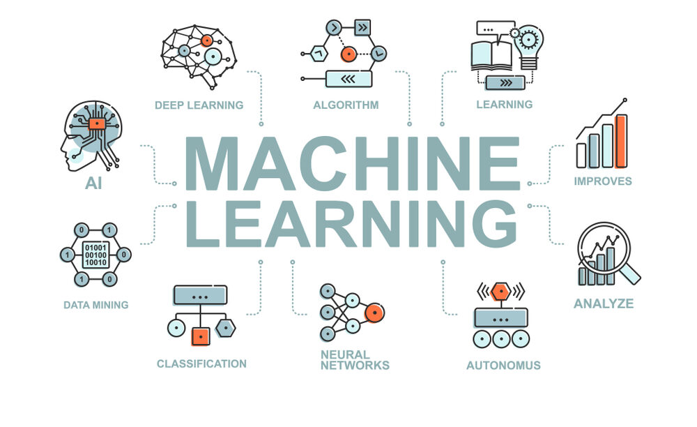

# Slotin - The Official Documentation

## Official Documentation for Slotin - The Appointment Booking Platform

Streamlit Docs(https://slotin-docs.streamlit.app/)

## 🚀 Welcome to Slotin!
**Slotin** is an innovative platform designed to streamline the appointment booking process across various sectors. Whether it’s for healthcare, beauty services, or business consultations, Slotin addresses the challenges of managing appointments effectively. With millions of appointments booked daily, our platform aims to enhance user experience by simplifying the scheduling process for both providers and clients.

Our platform leverages advanced technology to facilitate seamless appointment management, offering features that enhance convenience and efficiency. Here’s how Slotin can transform appointment booking:


### 🔍 Key Features of Slotin
- **User-Friendly Interface:** Enjoy an intuitive interface that makes scheduling appointments easy for all users.
- **Real-Time Availability:** View real-time availability of service providers to book appointments instantly.
- **Automated Reminders:** Receive automated reminders and notifications to reduce no-shows and keep clients informed.
- **Customizable Booking Forms:** Create tailored booking forms to capture necessary information from clients.
- **Secure Payment Integration:** Enable secure payment processing to facilitate seamless transactions during booking.
Actionable Insights: Access analytics and insights to optimize scheduling and improve service delivery.
### 🚗 Product Workflow
Here’s how Slotin works:

1. **Select a Service:** Users can choose the service they wish to book from a list of available options.
2. **Check Availability:** The platform displays real-time availability for the selected service provider.
3. **Book an Appointment:** Users fill out the booking form with necessary details and confirm the appointment.
4. **Receive Confirmation:** Users receive a confirmation email/SMS with appointment details and a calendar invite.
5. **Automated Reminders:** Prior to the appointment, clients receive automated reminders to ensure attendance.

Whether you’re a service provider or a client, Slotin ensures that booking appointments is a hassle-free experience.
### 🔗 Get Started
Ready to simplify your scheduling process? Start using Slotin to experience how our innovative technology can enhance your appointment management and improve service delivery.

Explore our features and see how Slotin can support your efforts in booking and managing appointments seamlessly!

# 🚀 Frontend - Slotin


Slotin’s frontend is designed to ensure a user-friendly experience across both our mobile application and web interface. Whether it’s booking appointments, tracking confirmations, or managing user preferences, the frontend is built with modern technologies to provide seamless interaction and real-time responsiveness for all users.

Here's an overview of the key components and features of slotin's frontend:


## 🔧 Key Components of Slotin's Frontend


1. **Mobile and Web Interface:** Slotin provides both a mobile application and a web interface, ensuring accessibility across various platforms. Users can book appointments and manage their schedules seamlessly, enjoying a consistent experience on both devices.

2. **Dynamic Appointment Feed:** The mobile app and web interface feature a dynamic feed displaying upcoming appointments and updates. Each entry includes details such as service type, provider, date, time, and any special notes, keeping users informed in real time.

3. **Real-Time Appointment Updates:** Users receive immediate updates about their appointments, including confirmations, changes, and reminders. This ensures that clients are always informed and can adjust their plans accordingly.

4. **User Dashboard:** The web interface includes a dedicated dashboard for users to view their booking history, upcoming appointments, and cancellation options. This feature provides a comprehensive overview of their scheduling activities.


5. **Real-Time Notifications:** Every user receives real-time notifications regarding their appointments, including reminders and updates from service providers. This feature enhances communication and helps reduce no-shows.

6. **Booking Status Updates:** Users can easily check the status of their appointments, including confirmation of bookings or any changes made by the service provider. This transparency helps in building trust and improving the user experience.

7. **Provider Interaction:** A dedicated section allows users to interact with service providers, enabling direct communication for questions or changes related to their appointments. This fosters better engagement and service quality.

8. **Privacy Controls for User Information:** To protect user privacy, personal information is securely managed, and sensitive data is only shared with service providers when necessary. Users can feel confident in their data security while using the platform.


## 🚀 Technologies Used in Slotin's Frontend


1. **React.js:** Slotin’s frontend is built using React.js, a powerful JavaScript library for creating interactive user interfaces. React allows for a component-based architecture, making it easy to manage and update the UI in response to user interactions.

2. **Redux Toolkit:** Redux Toolkit is employed for state management, ensuring that Slotin’s frontend maintains a consistent and predictable state across all components. This simplifies handling complex data flows and enables efficient management of real-time updates.

3. **Framer Motion:** Framer Motion is used to add animations and interactions to the frontend, creating a dynamic and engaging user experience. Smooth transitions and interactive elements enhance usability and engagement.

4. **TypeScript:** TypeScript is the primary programming language used in Slotin’s frontend, providing type safety and improving code maintainability. This leads to fewer errors and increased development efficiency.
# 🚀 Backend - Slotin


Slotin's backend is the backbone of our platform, powering the essential functionality that enables seamless appointment booking, user management, and real-time notifications. Designed to handle a variety of tasks, our backend processes user requests, manages data, and integrates with external services to enhance user experience.

Here's an overview of the key components and features of Slotin's backend:


## 🔧 Key Components of Slotin's Backend

1. **WebSockets for Real-Time Communication:** Slotin's backend utilizes WebSockets to maintain a persistent connection between clients (mobile or web) and the server, enabling real-time updates for appointment bookings and notifications.

2. **Redis Queue for Task Management:** When an appointment is booked or modified, the details are sent to a Redis queue. This ensures that all requests are efficiently managed and processed without any data loss.

3. **Frontend and Backend Synchronization:** Changes in appointment status or new bookings are reflected in real time on both the backend and frontend, creating a smooth and responsive user experience.

4. **Redis Queue Policies:** The Redis queue implements policies to trigger further processing steps, ensuring that appointment data is handled in a timely manner.

5. **Worker Processes for Data Handling:** Worker processes manage tasks such as sending confirmation emails, updating appointment statuses, and handling other asynchronous operations to enhance performance.

6. **MongoDB for Data Storage:** All appointment data, user profiles, and booking histories are stored in MongoDB. Its flexible schema design allows for efficient storage and retrieval of user and appointment information.

7. **End-to-End Real-Time System:** This backend architecture allows Slotin to efficiently manage appointment bookings and updates in real time, ensuring that users receive timely notifications and that all critical data is securely stored and processed.


## 🚀 Technologies Used in Slotin's Backend

1. **TypeScript:** Slotin's backend is built with TypeScript, ensuring type safety and scalability, which helps maintain a clean and efficient codebase.

2. **Redis:** Redis serves as a queue management system, ensuring that all appointment bookings, updates, and processing tasks are handled in an organized and reliable manner. It helps maintain smooth data flow and guarantees that no request is missed.

3. **MongoDB:** MongoDB is used as the primary database for storing appointment data, user profiles, and booking histories. Its flexible schema design allows for efficient storage and retrieval of diverse data types.

4. **Express.js:** Slotin utilizes Express.js as the web framework to build robust and scalable server-side applications. It simplifies the routing and handling of requests.

5. **WebSockets:** WebSockets provide a persistent connection between the client and server, enabling real-time data transfer, particularly for booking confirmations and notifications.

6. **Docker:** Docker is employed for containerization, ensuring consistency in the backend environment across different systems and simplifying the deployment process.

7. **Amazon EC2:** Amazon EC2 hosts Slotin’s backend, providing scalable and secure compute capacity to run our server and handle real-time booking data.

8. **Amazon S3:** Amazon S3 is used for storing any uploaded files or documents related to appointments, ensuring secure and scalable storage with easy access when needed.


# 🧠 Machine Learning - Slotin



## 🚀 Overview of Machine Learning Models in Slotin

Slotin leverages advanced machine learning models to enhance appointment booking and user experience. Our application integrates two key models:

1. **Appointment Classification Model:** This model is fine-tuned to categorize appointments based on user input and historical data, helping optimize scheduling and resource allocation.

2. **Natural Language Processing (NLP) Model:** Utilizing NLP techniques, this model analyzes user queries and feedback, providing insights and improving communication between users and service providers.


## 🔍 How the Appointment Classification Model Works

Our classification model is designed to enhance the booking process. Here’s a breakdown of its core features and functionality:


- **Fine-Tuning:** The model has been fine-tuned using a specialized dataset of appointment data. By adjusting the parameters and optimizing the learning process, we've trained the model to accurately classify and predict appointment types and needs.

- **Classification Accuracy:** Upon processing user inputs, the model generates predictions that classify the type of appointment, allowing for tailored scheduling that meets user expectations.

- **Real-Time Inference:** The model is capable of real-time inference, ensuring that user requests are processed quickly and efficiently, which is essential for a smooth booking experience.

Below is a sample Python code demonstrating how we might implement the appointment classification model:

```python
import pandas as pd
from sklearn.model_selection import train_test_split
from sklearn.ensemble import RandomForestClassifier
from sklearn.metrics import accuracy_score ``
    
# Load dataset
data = pd.read_csv('appointments.csv')
   
# Preprocess data
X = data[['feature1', 'feature2', 'feature3']]
y = data['appointment_type']
X_train, X_test, y_train, y_test = train_test_split(X,test_size=0.2, random_state=42)
 
# Train model
model = RandomForestClassifier()
model.fit(X_train, y_train)
         
# Make predictions
predictions = model.predict(X_test)

# Evaluate accuracy
accuracy = accuracy_score(y_test, predictions)
print(f'Accuracy: {accuracy * 100:.2f}%')
```
## 🔍 How the NLP Model Works
The NLP model is focused on understanding and analyzing user interactions. Here’s how it contributes:
- **User Query Analysis:** The model processes user queries to provide quick and relevant responses, ensuring that users receive the information they need without delay.
- **Sentiment Analysis:** By analyzing user feedback, the model helps identify areas for improvement in service delivery, enhancing overall user satisfaction.
# 💼 Revenue Model - Slotin

Slotin’s revenue model is crafted to capitalize on various streams while aligning with its mission to simplify appointment scheduling and enhance user experience. By collaborating with service providers and leveraging technology, Slotin aims to create sustainable revenue opportunities while delivering significant value to its users.

Here's a breakdown of the key revenue streams that Slotin employs:


## 🏛️ Government Partnerships

Slotin collaborates with local government entities, such as health departments and community organizations, to enhance public service delivery through efficient appointment scheduling. By integrating with government systems, Slotin helps streamline public health initiatives, vaccination drives, and community services.

**Monetization Strategy:** Governments can subscribe to Slotin’s platform for a fee, gaining access to scheduling tools and analytics that facilitate community engagement and resource allocation. These partnerships create stable revenue streams while improving service delivery in public health and safety.


## 🚨 Premium Services for First Responders

Slotin offers premium services tailored for businesses that provide appointments, such as healthcare providers and beauty salons. These premium features include advanced analytics, priority booking options, and enhanced customer management tools that allow service providers to optimize their operations.

**Monetization Strategy:** Service providers can subscribe to premium plans for a monthly or annual fee, unlocking advanced functionalities that improve booking efficiency and customer engagement. This creates added value for providers while generating consistent revenue for Slotin.

## 📊 Data Licensing

Slotin collects anonymized data from user interactions and appointment trends, which can be valuable to market researchers, healthcare organizations, and urban planners. This data can inform service improvements and community health initiatives.

**Monetization Strategy:** Slotin can license this anonymized data to third-party organizations at a fixed price or subscription-based model. By providing insights into appointment patterns and user preferences, Slotin helps stakeholders make data-driven decisions.

## 📢 Advertisement Integration

Slotin’s platform serves as an effective venue for relevant advertisements from industries such as healthcare services, wellness products, and local businesses. These advertisements are integrated seamlessly into the user experience, ensuring they are helpful and contextually relevant.

Monetization Strategy: Advertisement slots within the app can be sold to businesses on a pay-per-click or pay-per-view basis, offering targeted exposure to users seeking related services. This ensures that ads are not only relevant but also beneficial to users, enhancing overall engagement


## ❓ FAQs


### Q1: How does Slotin ensure user privacy when booking appointments?
🔐 Slotin prioritizes user privacy by implementing strict data protection measures. Personal information is kept confidential and is only accessible to the relevant service providers. Users can book appointments without revealing their identity to the public, ensuring privacy while facilitating effective communication.

### Q2: How does Slotin manage appointment scheduling effectively?
🛡️ Slotin utilizes advanced algorithms to optimize appointment scheduling. The platform analyzes user preferences and availability, automatically suggesting the best times for both users and service providers, ensuring a smooth booking experience.

### Q3: Which services are currently available on Slotin?
🌍 Slotin currently partners with various service providers across healthcare, beauty, and wellness sectors. We continuously seek to expand our network, ensuring users have access to a wide range of appointment options.

### Q4: How does Slotin notify users of appointment confirmations or changes?
🔔 Slotin features an integrated notification system that instantly alerts users via email and app notifications when appointments are confirmed, modified, or canceled. This ensures users are always informed and can plan accordingly.

### Q5: How does Slotin handle appointment cancellations or no-shows?
🔄 Slotin has a flexible cancellation policy that allows users to reschedule or cancel appointments with ease. Service providers are notified in real-time, helping them manage their schedules efficiently and reduce no-show rates.

### Q6: What makes Slotin different from other appointment booking platforms?
✨ Slotin stands out due to its user-friendly interface, real-time scheduling optimization, and commitment to privacy. Unlike other platforms, we focus on providing personalized experiences while ensuring users’ data is secure.

### Q7: Can Slotin integrate with existing scheduling systems of service providers?
🔗 Absolutely! Slotin is designed to integrate seamlessly with the scheduling systems of our service partners, enabling smooth operations and real-time updates for both users and providers, enhancing overall efficiency.
## 🚀 Competition and Roadmap

### 🌐 Competitive Landscape

Slotin is at the forefront of appointment booking solutions, providing a streamlined platform for scheduling services. While there are various competitors in the market, Slotin distinguishes itself with its unique features and user-centric design. Here’s how Slotin stands out:

### 🤼 Competitors

#### **1. Calendly 📅**
- **What They Do:** Calendly allows users to create personalized scheduling links for meetings, simplifying the appointment booking process.
- **Edge Over Them:** While Calendly focuses on meeting scheduling, Slotin offers a dedicated appointment booking experience tailored for specific services, with features like service categorization and customer management, making it more suited for businesses.

#### **2. Doodle 📊**
- **What They Do:** Doodle helps groups find suitable meeting times by allowing participants to vote on their availability.
- **Edge Over Them:** Doodle is great for group scheduling but lacks the comprehensive features for individual appointments that Slotin provides. Slotin’s interface is designed for seamless user interactions, offering a more efficient booking experience.

#### **3. Acuity Scheduling ⏰**
- **What They Do:** Acuity Scheduling offers robust features for managing appointments, including reminders and client self-scheduling.
- **Edge Over Them:** While Acuity provides strong appointment management, Slotin emphasizes ease of use with a more intuitive interface, ensuring that both service providers and clients can navigate the platform effortlessly.

#### **4. Booksy 💼**
- **What They Do:** Booksy is a booking platform primarily for beauty and wellness services, allowing users to find and book appointments with professionals.
- **Edge Over Them:** Booksy targets a specific industry, whereas Slotin is versatile and caters to a wider range of services. This flexibility makes Slotin ideal for various sectors beyond beauty and wellness.

#### **5. SimplyBook.me 🗓️**
- **What They Do:** SimplyBook.me offers customizable booking solutions for businesses, with features like payment processing and reminders.
- **Edge Over Them:** While SimplyBook.me is highly customizable, Slotin focuses on delivering a simpler, user-friendly experience without overwhelming users with complex settings, making appointment booking quick and hassle-free.


Here's a revised version of the **Roadmap** and **Get Involved** sections for **Slotin**:

---

### 🗺️ Roadmap
Slotin is committed to continuous innovation and enhancing its features. Here's a look at our roadmap for the platform:

- **Phase 1 (Current):**
  - Streamlined appointment booking and scheduling
  - User privacy safeguards in booking processes
  - Real-time notifications for appointment confirmations and changes

- **Phase 2 (Q3 2024):**
  - Integration with service providers for automated appointment management
  - Expansion to include additional service categories (e.g., wellness, fitness)
  - Enhanced algorithms for personalized service recommendations

- **Phase 3 (Q1 2025):**
  - Collaboration with healthcare providers for telehealth appointments
  - Introduction of AI-driven analytics to optimize user scheduling preferences
  - Expansion of Slotin to international markets

- **Phase 4 (Q3 2025):**
  - Integration with third-party calendars for seamless scheduling
  - Advanced analytics for user behavior and appointment trends
  - Public-facing dashboards for service provider performance and user insights

Slotin is dedicated to advancing appointment management solutions, continuously improving the platform to better serve users and service providers. Together, we aim to make booking appointments easier and more efficient for everyone. 🌟

---

## 🌟 Get Involved with Slotin

### 🤝 Contribute to Slotin
We welcome contributions from the community to help shape the future of Slotin. Here’s how you can get involved and make an impact:

1. **Fork the Repository**: Click the "Fork" button on the [Slotin GitHub repository](https://github.com/Aryanmittal23/SlotIn.git) to create your own copy of the project. 🍴
2. **Clone Your Fork**: Clone the repository to your local machine using:
    ```bash
    https://github.com/Aryanmittal23/SlotIn.git
    ```
    🖥️
3. **Set Up Development Environment**: Navigate to the project directory and install dependencies:
    ```bash
    cd Slotin
    npm install
    ```
    ⚙️
4. **Make Changes**: Create a new branch, make your changes, and commit them. ✏️
5. **Submit a Pull Request**: Push your changes to your fork and submit a pull request to contribute your improvements. 🔄

---


We're excited to see your contributions! Thank you for being a part of the Slotin community. 🙌

[Visit GitHub Repository](https://github.com/Aryanmittal23/SlotIn.git)